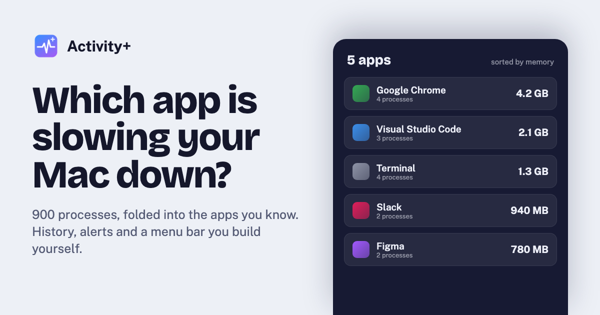
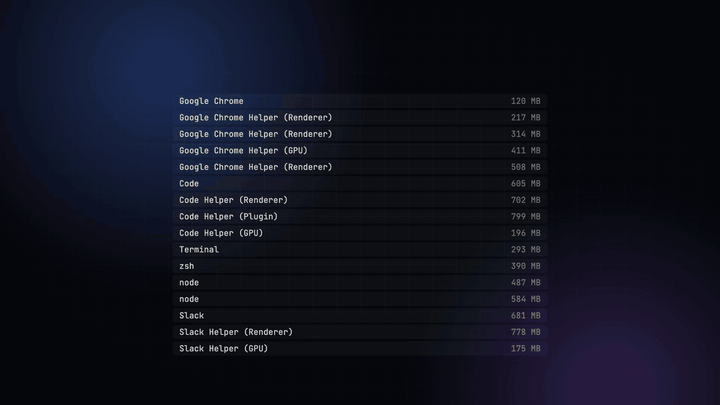
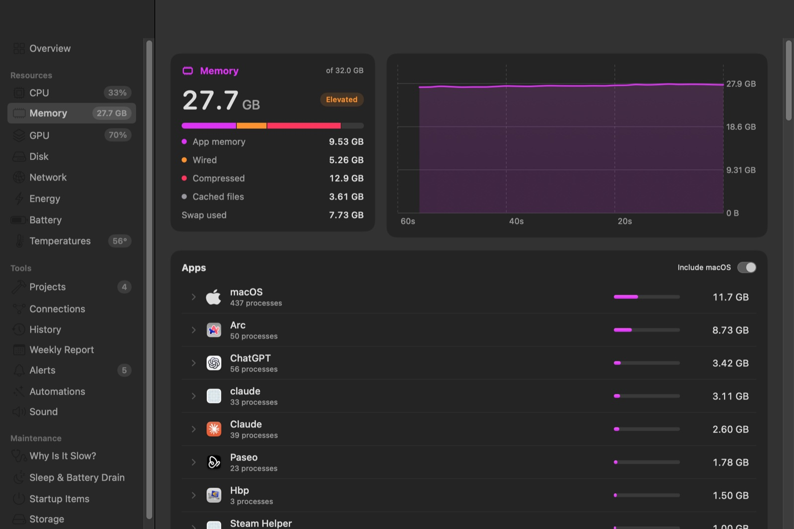
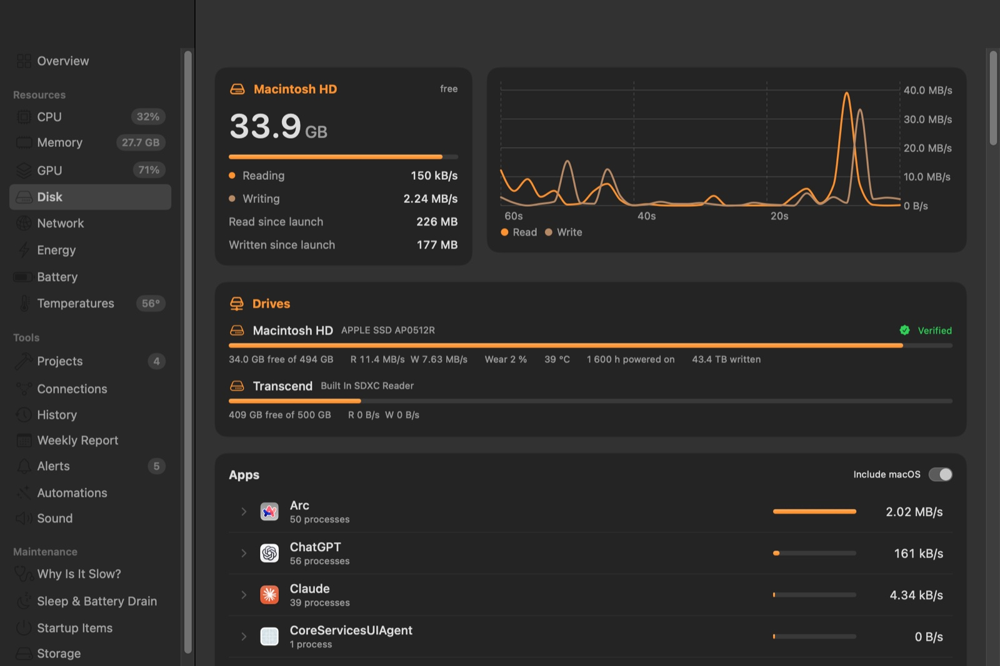
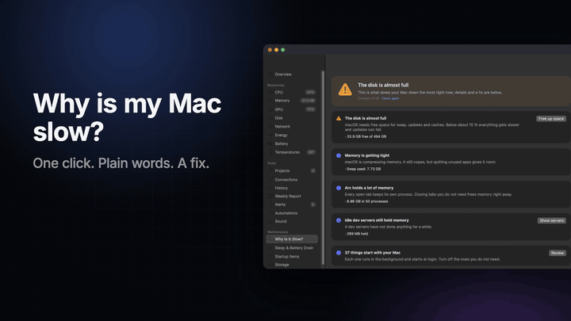
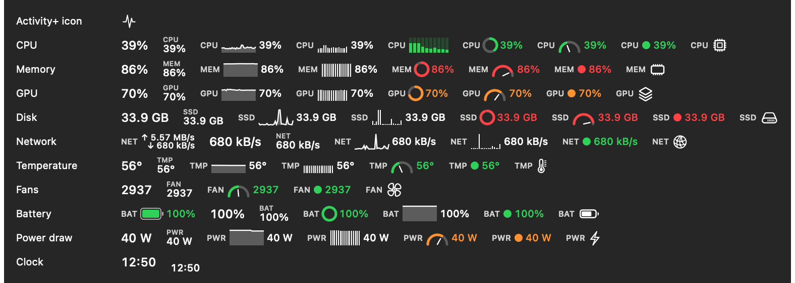
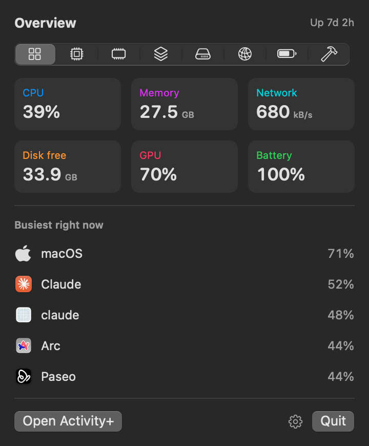
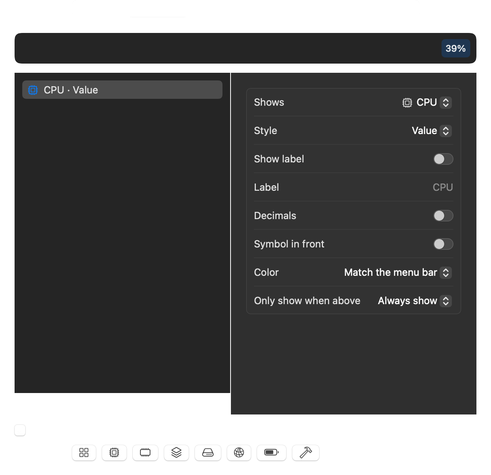
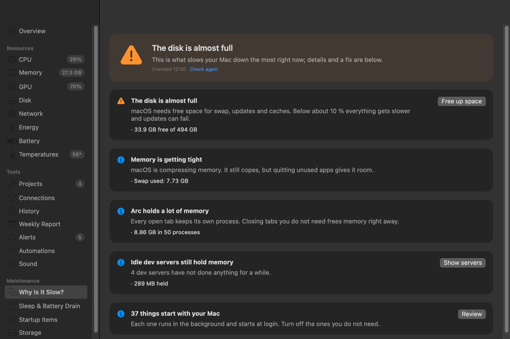

<p align="center"></p>

<p align="center">
  <a href="https://activityplus.xyz"><b>Website</b></a> &nbsp;·&nbsp;
  <a href="https://activityplus.xyz/#download"><b>Download</b></a> &nbsp;·&nbsp;
  <a href="https://activityplus.xyz/assets/video/activityplus-trailer.mp4"><b>Film ansehen (1 Min.)</b></a> &nbsp;·&nbsp;
  <a href="README.md">English</a>
</p>

<p align="center">
  
  
  
  
</p>

# Activity+

**Ein Systemmonitor für macOS, der sagt, welche App verantwortlich ist – und was man dagegen tun kann.**

Die Aktivitätsanzeige listet rund 900 Prozesse. Activity+ fasst sie zu den rund 80 Apps zusammen, die Sie kennen, speichert 30 Tage Verlauf, warnt, wenn sich eine App danebenbenimmt, erklärt, warum der Mac langsam ist, und sitzt in einer Menüleiste, die Sie selbst zusammenstellen. Alle Daten bleiben auf dem Mac.

<p align="center"></p>

## Download

Die aktuelle notarisierte Version gibt es auf **[activityplus.xyz](https://activityplus.xyz/#download)**. Entpacken, **Activity+.app** in den Programme-Ordner ziehen und öffnen. Updates kommen einmal am Tag automatisch; das lässt sich in den Einstellungen abschalten.

Voraussetzung ist ein Mac mit Apple silicon und macOS 15 Sequoia oder neuer. Entwickelt und getestet auf einem M1 Max.

## Was es kann

### Sehen, welche App verantwortlich ist
- **Prozesse nach App gruppiert.** Aus den Hilfsprozessen von Chrome wird eine Chrome-Zeile. Activity+ nutzt dieselbe „verantwortlicher Prozess“-Information wie macOS für Berechtigungsabfragen: `node`, im Terminal gestartet, zählt zum Terminal, MCP-Server zählen zur App, die sie gestartet hat.
- **CPU, Speicher, GPU, Festplatte, Netzwerk und Energie pro App.** Energie wird in Watt aus den Zählern des Kernels gemessen, GPU-Zeit pro App aus dem Metal-Treiber.
- **Prozess-Inspektor.** Doppelklick auf einen Prozess zeigt Befehlszeile, Arbeitsordner, wer ihn gestartet hat, wer ihn signiert hat (und ob er notarisiert ist), offene Dateien und Netzwerkverbindungen.
- **Verbindungen.** Mit welchen Servern jede App gerade spricht. Hostnamen werden nur nachgeschlagen, wenn Sie das einschalten.



### Hardware
- CPU pro Kern (Effizienz- und Leistungskerne), **Takt pro Cluster**, Last, Temperaturzustand.
- Speicherdruck, Swap, Komprimierung.
- GPU-Auslastung, Takt und Leistung.
- **Alle Laufwerke** mit freiem Platz, Durchsatz, SMART-Status sowie NVMe-Verschleiß, -Temperatur, Betriebsstunden und geschriebenen Daten.
- Netzwerk-Durchsatz, Schnittstellen, Adressen, WLAN-Signal, Kanal und Verbindungsgeschwindigkeit. Die öffentliche IP wird nur auf Klick abgefragt.
- **Alle Sensoren**: mehrere hundert Temperaturen, Spannungen, Ströme und Leistungswerte, dazu die Lüfter.
- Akku-Zustand, Ladezyklen und Leistungsaufnahme, dazu die Akkus von AirPods, Magic Mouse, Keyboard und Trackpad.



### Eine Menüleiste, wie Sie sie wollen
Beliebig viele Menüleisten-Einträge. Jeder zeigt eine Sache (CPU, Speicher, GPU, Festplatte, Netzwerk, Temperatur, Lüfter, Akku, Leistung oder eine Uhr mit Zeitzonen) in einem von elf Stilen: Wert, Beschriftung und Wert, Liniendiagramm, Balkendiagramm, Balken pro Kern, Ring, Tacho, Punkt, Up/Down-Geschwindigkeit, Akku oder Symbol. Farben passen sich der Menüleiste an, gehen mit der Last von Grün nach Rot oder folgen einer selbst gewählten Farbe. Ein Eintrag kann sich ausblenden, bis sein Wert hoch ist. Ein Rechtsklick auf einen Eintrag schaltet Module ein und aus, wählt eine Voreinstellung (minimal, ausgewogen, alles) oder setzt Symbole vor die Werte; ein Klick öffnet ein kompaktes Panel auf dem passenden Reiter.

<p align="center"></p>



<p>


</p>

Alles, was spürbar CPU kostet, hat einen eigenen Schalter unter **Einstellungen → Leistung**; nur mit der Menüleiste braucht Activity+ etwa 1,4 % eines Kerns.

Auch der Rest lässt sich einstellen: welche Seiten die Seitenleiste zeigt, welche Übersichtskarten in welcher Reihenfolge erscheinen, die Akzentfarbe, °C oder °F, Bytes oder Bits für Netzwerk-Geschwindigkeiten, das Aktualisierungsintervall und die Reiter des Menüleisten-Panels.

### Warum ist mein Mac langsam?
Ein Klick liefert eine Antwort in klaren Worten: zu wenig Speicher, eine App unter Volllast, Drosselung wegen Hitze, fast volle Festplatte, Spotlight-Indizierung, untätige Dev-Server, lange Laufzeit mit viel Swap, verschlissener Akku. Jeder Befund zeigt seine Belege und bietet die passende Abhilfe an.



### Verlauf, Warnungen und Auffälligkeiten
- **30 Tage Verlauf** in einer kleinen SQLite-Datei: Diagramme von 12 Stunden bis 30 Tage, welche Apps am meisten verbraucht haben, heute und diese Woche geschriebene und geladene Daten.
- **Warnungen**, wenn eine App die CPU dauerhaft belastet, ständig mehr Speicher braucht oder Festplatte bzw. Netzwerk stark beansprucht – und wenn der Speicher knapp wird, die Festplatte vollläuft, der Mac überhitzt oder eine App hängt.
- **Ungewöhnlich für diese App.** Activity+ lernt, was für jede App normal ist, und meldet deutliche Abweichungen („Slack braucht 3,2 × so viel Speicher wie sonst“). Gleichmäßiges Wachstum bei gleichbleibenden Prozessen wird als wahrscheinliches Speicherleck gemeldet, mit Prognose.
- **Wochenbericht** jeden Montag: die Apps mit dem meisten Energie-, Speicher-, CPU- und Netzwerkverbrauch, im Vergleich zur Vorwoche.
- **Schlaf und Akkuverbrauch.** Was den Mac gerade wach hält, was ihn geweckt hat und welche Apps den Akku ohne Netzteil geleert haben.

### Dinge erledigen lassen
- **Automationen**: „Dev-Server stoppen, die seit einem Tag nichts tun“, „App beenden, wenn sie mehr als 4 GB braucht“. Jede Regel fragt zuerst per Mitteilung mit Knopf nach – außer Sie erlauben ausdrücklich, dass sie selbstständig handelt.
- **Dev-Server nach Projekt**, mit Ports und Angabe, ob sie arbeiten, ruhen oder kaum genutzt werden. Einen vergessenen Server mit einem bestätigten Klick stoppen.
- **Startobjekte** nach App gruppiert, mit Schaltern für die Einträge im eigenen Benutzerkonto.
- **Speicherplatz pro App**, inklusive allem, was die App in der Library ablegt, dazu Entwickler-Caches. Caches und Logs lassen sich in den Papierkorb legen. **Deinstallieren** samt Resten (gemeinsame Daten anderer Apps bleiben).
- **Große und alte Dateien**: benutzte Installer, nie wieder geöffnete Downloads, Riesendateien. Ausgewählt wird nur, was Sie wählen.
- **Festplatten-Speedtest**: sequenzielle Schreib- und Leserate der SSD.
- **Panel-Editor**: Kacheln des Menüleisten-Panels auswählen und sortieren, Anzahl der aktivsten Apps, Theme.
- **Lautstärke pro App** (Beta), Beenden und sofort Beenden aus jeder Liste sowie eine Share-Card (1200 × 630) mit dem Zustand des Macs.

Alles, was einen Prozess beendet, einen Server stoppt, ein Startobjekt ändert oder Dateien verschiebt, fragt vorher nach.

## Für KI-Agenten

`aplus mcp` ist ein [Model Context Protocol](https://modelcontextprotocol.io)-Server, der nur liest, mit sieben Tools: Übersicht, Top-Apps, Prozesse einer App, Diagnose, Dev-Server, Verlauf und Startobjekte. Mit Claude Code:

```bash
claude mcp add activity-plus -- "/Applications/Activity+.app/Contents/Resources/aplus" mcp
```

Danach etwa fragen: „Warum ist mein Mac langsam?“ oder „Welcher Dev-Server ruht?“. Dasselbe Programm zeigt eine Terminal-Ansicht (`aplus`, `aplus --memory`) und JSON (`aplus --json`).

## Datenschutz

Activity+ hat kein Konto und keine Analyse. Die einzige automatische Netzwerkanfrage ist die tägliche Update-Prüfung, die sich abschalten lässt. Öffentliche IP und Hostnamen werden nur auf Wunsch abgefragt. Der Verlauf liegt in `~/Library/Application Support/Activity+/`; wer diesen Ordner löscht, entfernt alles.

## Woher die Zahlen kommen

| Wert | Quelle |
|---|---|
| Prozessliste; CPU von Prozessen anderer Benutzer | `/bin/ps` (sieht alle Prozesse ohne privilegierten Helfer) |
| Speicher, Festplatten-I/O, Energie eigener Prozesse | `proc_pid_rusage` |
| Gruppierung nach App | verantwortlicher Prozess, dann App-Pfade, dann Elternprozesse |
| CPU, Speicher, Swap, Speicherdruck | `host_processor_info`, `host_statistics64`, `sysctl` |
| Takt, GPU-Leistung | IOReport (Leistungszustände und Energiemodell) |
| GPU-Auslastung und GPU-Zeit pro App | IOKit `IOAccelerator` |
| Temperaturen, Spannungen, Ströme, Lüfter | IOHID-Ereignissystem und SMC |
| Laufwerke und NVMe-Zustand | IOKit-Statistiken und NVMe-SMART-Log |
| Netzwerk | `sysctl NET_RT_IFLIST2`, `nettop` pro App, SystemConfiguration, CoreWLAN |
| Dev-Server und Verbindungen | `lsof` |

Prozesse anderer Benutzer (root, `_windowserver`) zeigen CPU und belegten Speicher, aber keine Festplatten- und Energiewerte; sie sind als „eingeschränkte Details“ markiert.

## Selbst bauen

Benötigt Xcode 26 oder neuer. Die Skripte verwenden `/Applications/Xcode-beta.app`; mit `DEVELOPER_DIR` lässt sich ein anderes Xcode wählen.

```bash
scripts/build-app.sh --run      # Build in dist/ und starten
swift test                      # Unit-Tests
scripts/release.sh              # Developer-ID-Signatur und Notarisierung (braucht Zugangsdaten)
```

Der Code besteht aus `ActivityCore` (Messung, Verlauf, Regeln; ohne Oberfläche), der SwiftUI-App `ActivityPlus` und dem Kommandozeilenwerkzeug `aplus`.

## Stand

Activity+ ist jung. Lautstärke pro App, Hänger-Erkennung und die Zubehör-Akkus sind Beta: gebaut und geprüft, aber noch wenig im Alltag erprobt. Was als Nächstes kommt, steht in [ROADMAP.md](ROADMAP.md).

Inspiriert von der Aktivitätsanzeige, [Vitals](https://vitalsmac.com) und [Stats](https://mac-stats.com).

## Lizenz

MIT, siehe [LICENSE](LICENSE).
