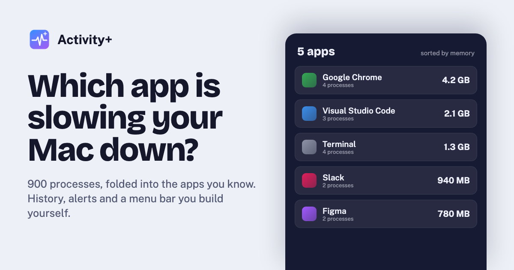
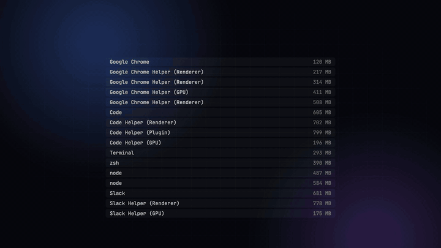
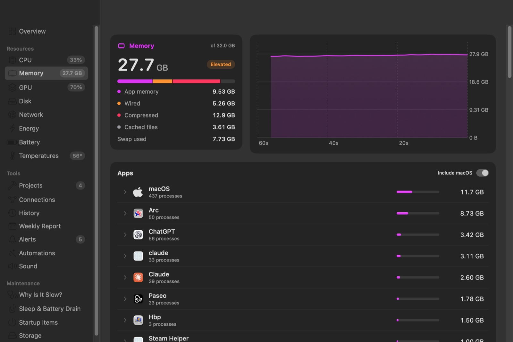
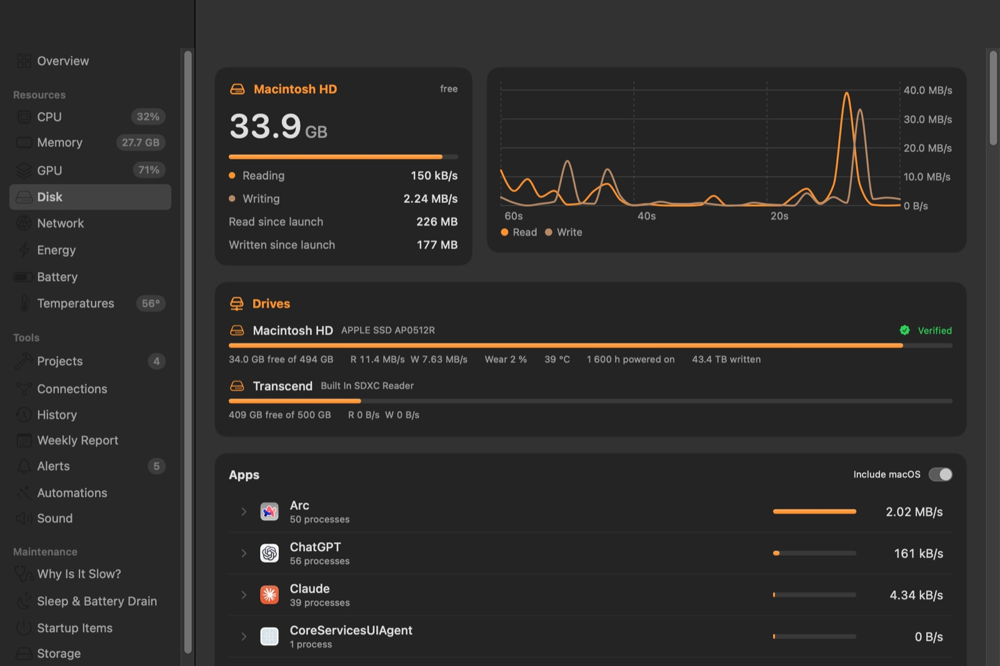
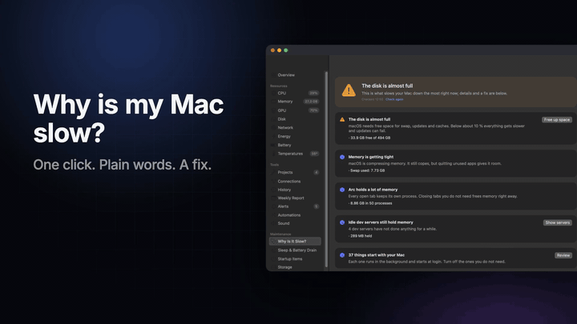
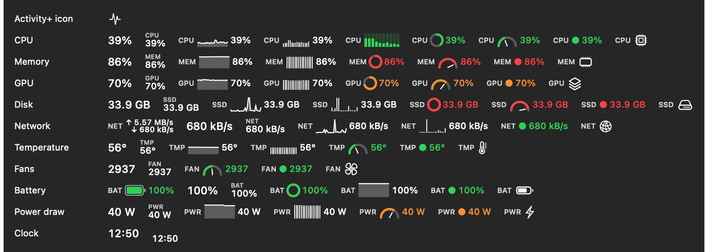
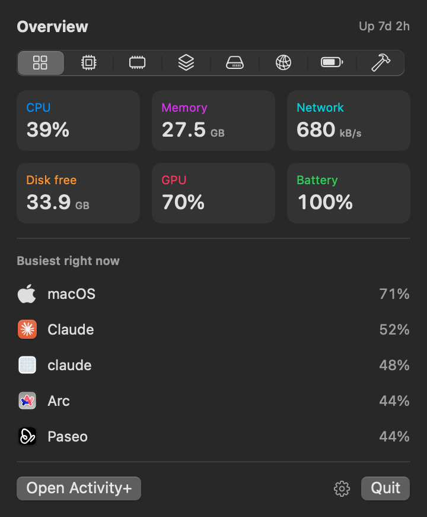
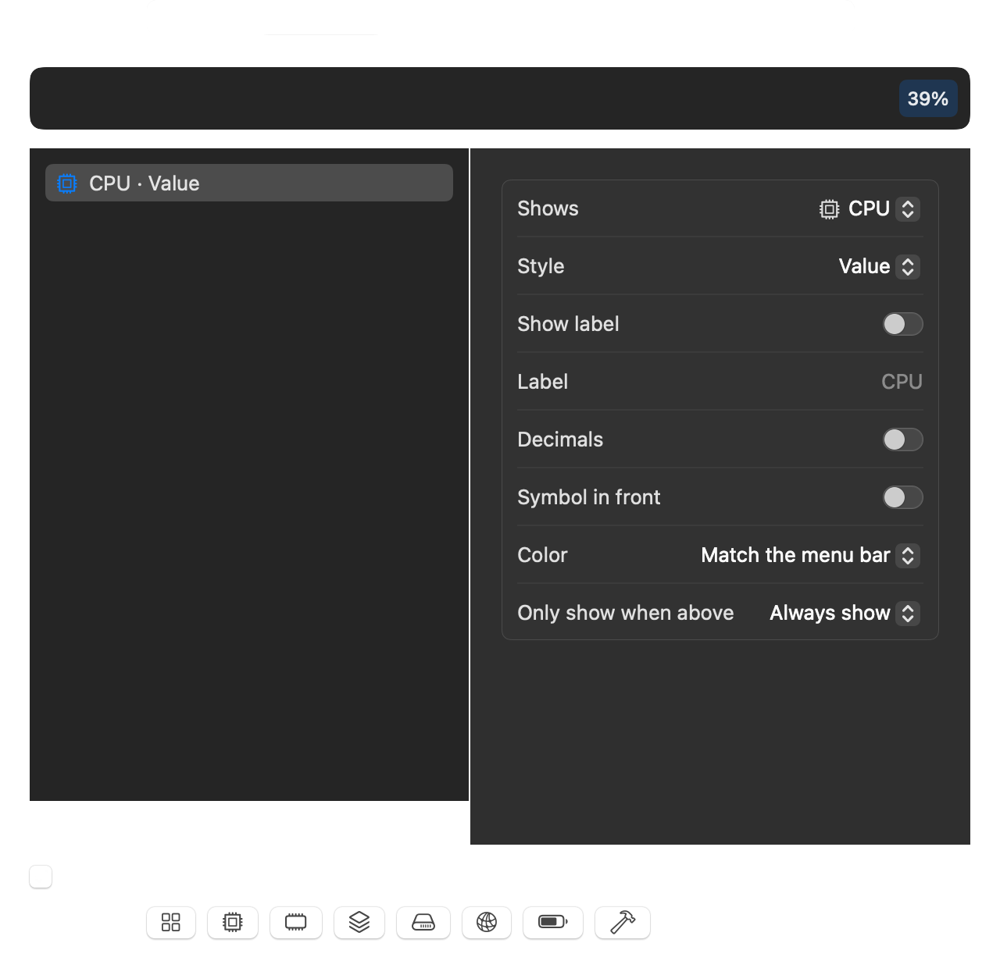
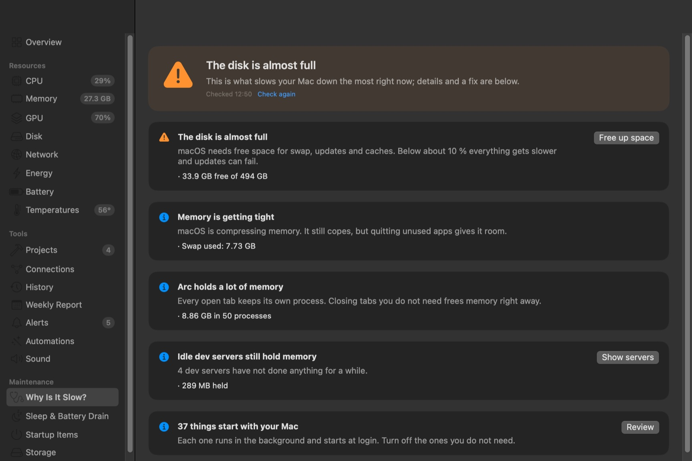

<p align="center"></p>

<p align="center">
  <a href="https://activityplus.xyz"><b>Website</b></a> &nbsp;·&nbsp;
  <a href="https://activityplus.xyz/#download"><b>Download</b></a> &nbsp;·&nbsp;
  <a href="https://activityplus.xyz/assets/video/activityplus-trailer.mp4"><b>Watch the film (1 min)</b></a> &nbsp;·&nbsp;
  <a href="README.de.md">Deutsch</a>
</p>

<p align="center">
  
  
  
  
</p>

# Activity+

**A system monitor for macOS that tells you which app is responsible, and what to do about it.**

Activity Monitor lists about 900 processes. Activity+ folds them into the 80 or so apps you actually know, keeps 30 days of history, warns you when an app misbehaves, explains why your Mac is slow, and lives in a menu bar you build yourself. Everything stays on your Mac.

<p align="center"></p>

## Download

Get the latest notarized build from **[activityplus.xyz](https://activityplus.xyz/#download)**. Unzip it, move **Activity+.app** to Applications and open it. Updates arrive automatically once a day; you can turn that off in Settings.

Or with [Homebrew](https://github.com/robbyczgw-cla/homebrew-tap):

```sh
brew install robbyczgw-cla/tap/activity-plus
```

This also puts the `aplus` command line tool on your path.

Requires a Mac with Apple silicon and macOS 15 Sequoia or later. Developed and tested on an M1 Max. The app follows your Mac's language: English, German, French, Spanish, Italian, Portuguese (Brazil), Japanese or Simplified Chinese.

## What it does

### See which app is responsible
- **Processes grouped by app.** Chrome's helpers become one Chrome row. Activity+ uses the same "responsible process" information macOS uses for permission prompts, so `node` started in Terminal counts toward Terminal, and MCP servers count toward the app that launched them.
- **Per-app CPU, memory, GPU, disk, network and energy.** Energy is measured in watts by the kernel's per-task counters. GPU time per app comes from the Metal driver.
- **Process inspector.** Double-click a process to see its command line, working folder, who started it, who signed it (and whether it is notarized), open files and network connections.
- **Connections.** Which servers each app talks to right now. Host names are looked up only if you switch that on.
- **Performance or efficiency cores.** For each app, how much of its CPU time runs on performance cores and how many instructions it gets through per clock cycle (IPC).
- **Neural Engine memory per app**, so Core ML and local models show up instead of hiding behind the GPU figure.



### Hardware
- CPU per core (efficiency and performance), **clock speed per cluster**, load average, thermal state.
- Memory pressure, swap, compression.
- GPU load, clock (against the maximum) and power. **Find the app behind WindowServer**: most apps draw through WindowServer, so their GPU use shows up under its name. Activity+ hides your apps one at a time for a few seconds, measures how far WindowServer's GPU time drops, and shows them again.
- **Every drive** with free space, throughput, SMART status and NVMe wear, temperature, hours and data written. Which apps write the most to the SSD, and how many years it lasts at that pace, from the drive's own wear counter. A warning when a USB drive that can do USB 3 runs at USB 2 speed (usually the cable).
- Network throughput, interfaces, addresses, Wi-Fi signal, noise, channel and link speed. Your public IP is fetched only when you click for it. A network quality test with Apple's own `networkQuality` runs when you click.
- **Backup and security**: when Time Machine last backed up (with an alert after seven days), FileVault, System Integrity Protection, Gatekeeper and the firewall, and which app uses the microphone or camera right now.
- **Connection quality** (off until you turn it on): latency, jitter and packet loss to your router every 30 seconds, kept in the history, so a flaky connection is told apart from a slow one.
- **Displays**: refresh rate, resolution, HDR and ProMotion per screen, with a warning when a cable or dock holds a monitor below the rate it can do.
- **All sensors**: several hundred temperatures, voltages, currents and power readings, plus fans.
- Battery health in mAh (now, full, new) and charge cycles against the rated number. While charging: watts and percent per hour, time to full, where the adapter's power goes (Mac, battery, conversion loss), the voltage and current the adapter negotiated, the charging curve, and why the battery is not charging (full, Optimized Charging, charge limit, temperature, adapter too weak). A warning when the battery drains although the Mac is plugged in. Plus AirPods, Magic Mouse, Keyboard and Trackpad batteries.



### A menu bar that looks the way you want
Add as many menu bar items as you like. Each shows one thing (CPU, memory, GPU, disk, network, temperature, fans, battery, power or a clock with time zones) in one of eleven styles: value, label and value, line chart, bar chart, bar per core, ring, gauge, dot, up/down speed, battery or icon. Colors can match the menu bar, go from green to red with the load, or use a color you pick. An item can hide itself until its value is high, and a battery item can show the charging watts instead of the percentage. While the Mac charges, a bolt appears in the battery symbol; a plug shows that it is on the adapter without charging. Right-click any item to switch modules on and off, pick a preset (minimal, balanced, everything) or put symbols next to the values; click it for a compact panel on the matching tab. When the items don't fit next to the notch, they become one item (or always, if you prefer), and a click on a value still opens its tab. **The notch itself** shows live values when you rest the pointer on it, and short hints drop down when memory gets tight, the Mac gets hot, an app freezes or the charger is connected.

<p align="center"></p>



<p>


</p>

Everything that costs noticeable CPU has its own switch in **Settings → Performance**; with only the menu bar open, Activity+ uses about 1.4 % of one core.

The rest is adjustable too: text size and density of the window, the page it opens with, how many minutes the charts show, which pages the sidebar shows, which Overview cards appear and in which order, the accent color, °C or °F, bytes or bits for network speeds, the refresh interval, and which tabs the menu bar panel has.

### Why is my Mac slow?
One click gives a plain-language verdict: not enough memory, an app running flat out, heat throttling, a nearly full disk, Spotlight indexing, idle dev servers, a long uptime with heavy swap, a worn battery, a USB drive running at USB 2 speed, an app that keeps crashing. Each finding shows its evidence and offers the fix. The page also counts crashes per app (with the reason in plain words), shows Spotlight indexing while it runs, and names the apps that were busiest before the fans spun up.



### Where did my disk space go?
- **Explore**: your home folder (or another drive, or the whole startup disk) read once into a map: the biggest folders as a list and a treemap, a breakdown by kind, click to go inside. The map is kept, so it opens instantly, and Activity+ shows **what grew** since the last scan.
- **System Data explained**: the grey bar in Settings → Storage, split into developer data, caches, logs and what macOS manages itself, each with a reason and a safety badge.
- **Clean up**: one ticked list of things that can go to the Trash, each with its reason. Caches of apps that are open stay locked.
- **Biggest**: search the map as you type, with filters like `ext:dmg size:>1gb opened:>1y`.
- **Duplicates**: files that exist more than once, compared by content; one copy always stays.
- **Space Finder doesn't show**: purgeable space and APFS snapshots (local Time Machine backups, a prepared macOS update), explained, with the setting that deals with them.
- **Storage by app**, including everything the app keeps in your Library, and **uninstall** an app together with its leftovers (shared data of other apps stays).

Everything goes to the Trash after you confirm; nothing is deleted.

### History, alerts and insights
- **30 days of history** in one small SQLite file: charts for 12 hours to 30 days, which apps used the most, data written and downloaded today and this week. Point at a spike to see the processes behind it: "Terminal" turns out to be `node vite` (command lines are shortened, and anything that looks like a token or password is blanked).
- **Conditions** under the history chart: heat, memory pressure and Wi-Fi signal and noise for every minute, so a slow afternoon can be explained even when no single app stands out.
- **Alerts** when an app keeps the CPU busy, keeps growing in memory, or hammers the disk or network, and when memory runs out, the disk fills up, the Mac overheats, a VPN drops, or an app freezes. For a freeze, Activity+ records three seconds of the app's call stacks and names the spot it was stuck in.
- **Unusual for this app.** Activity+ learns what is normal for each app and tells you when it is far off ("Slack uses 3.2× its usual memory"). Steady growth with a stable set of processes is reported as a likely memory leak, with a forecast.
- **Recording sessions.** Start a recording before a build, a render or whatever makes your Mac slow; Activity+ measures every second, keeps the top apps, compares two sessions and exports CSV or JSON.
- **Weekly report** every Monday: the apps that used the most energy, memory, CPU and network, compared with the week before.
- **Sleep & battery drain.** What is keeping your Mac awake right now, what woke it up, and which apps drained the battery while it was unplugged.

### Let it take care of things
- **Automations**: "stop dev servers that have been idle for a day", "quit an app when it uses more than 4 GB". Each rule asks first with a notification button, unless you explicitly allow it to act on its own.
- **Dev servers by project**, with their ports and whether they are working, idle or barely used. Stop a forgotten one with one confirmed click.
- **Startup items** grouped by app, with switches for the ones in your account. Leftovers of apps you deleted are marked.
- **Disk speed test**: sequential write and read speed of your SSD.
- **Panel editor**: choose and order the tiles of the menu bar panel, how many busy apps it lists, and its theme.
- **Menu bar, Dock or both**, and **settings export and import** for another Mac.
- **Per-app volume** (beta), quit, force quit, pause and resume from any list, and a 1200 × 630 share card of your Mac's state.

Anything that quits a process, stops a server, changes a startup item or moves files asks first.

## For AI agents

`aplus mcp` is a read-only [Model Context Protocol](https://modelcontextprotocol.io) server with seven tools: overview, top apps, an app's processes, diagnosis, dev servers, history and startup items. With Claude Code:

```bash
claude mcp add activity-plus -- "/Applications/Activity+.app/Contents/Resources/aplus" mcp
```

Then ask "why is my Mac slow?" or "which dev server is idle?". The same binary prints a terminal view (`aplus`, `aplus --memory`) and JSON (`aplus --json`).

## Privacy

Activity+ has no account and no analytics. Its only automatic network request is the daily update check, which you can turn off. The public IP lookup and host-name lookups happen only when you ask for them. Connection quality, when you turn it on, pings your router; it pings a public host only if you enter one, and that host then sees your IP address. History lives in `~/Library/Application Support/Activity+/`; delete that folder to remove everything.

## How it measures

| Figure | Source |
|---|---|
| Process list; CPU of other users' processes | `/bin/ps` (sees every process without a privileged helper) |
| Memory footprint, disk I/O, energy of your processes | `proc_pid_rusage` |
| App grouping | responsible process, then app bundle paths, then the parent chain |
| CPU, memory, swap, pressure | `host_processor_info`, `host_statistics64`, `sysctl` |
| Clock speeds, GPU power | IOReport performance states and energy model |
| GPU load and per-app GPU time | IOKit `IOAccelerator` |
| The app behind WindowServer's GPU load | WindowServer's GPU time while each app is hidden (`NSRunningApplication.hide`), helper windows mapped to their app by the responsible process |
| Call stacks of a frozen app | `/usr/bin/sample`, three seconds, kept in `~/Library/Logs/Activity+/Freezes` |
| Snapshots and purgeable space | `diskutil apfs listSnapshots`, `volumeAvailableCapacityForImportantUsage` |
| USB drives below their speed | IOKit `IOUSBHostDevice` (`bcdUSB` against `Device Speed`) |
| VPN drops | the local VPN list (`scutil --nc list`), nothing is sent |
| Temperatures, voltages, currents, fans | IOHID event system and the SMC |
| Drives and NVMe health | IOKit block storage statistics and the NVMe SMART log |
| Network | `sysctl NET_RT_IFLIST2`, `nettop` per app, SystemConfiguration, CoreWLAN |
| Dev servers and connections | `lsof` |

Processes owned by other users (root, `_windowserver`) show CPU and resident memory but no disk or energy figures; they are marked "limited details".

## Build from source

Needs Xcode 26 or later. The scripts use `/Applications/Xcode.app`; set `DEVELOPER_DIR` to use another Xcode.

```bash
scripts/build-app.sh --run      # debug-signed build in dist/, then launch
swift test                      # unit tests
scripts/release.sh              # Developer ID signing and notarization (needs credentials)
```

The code is split into `ActivityCore` (samplers, history, rules; no UI), the SwiftUI app `ActivityPlus`, and the `aplus` command-line tool.

## Status

Activity+ is young. Per-app volume, freeze detection and accessory batteries are beta: they are built and pass their checks, but have seen little real-world testing. See [ROADMAP.md](ROADMAP.md) for what is next.

Inspired by Activity Monitor, [Vitals](https://vitalsmac.com) and [Stats](https://mac-stats.com).

## License

MIT, see [LICENSE](LICENSE).
